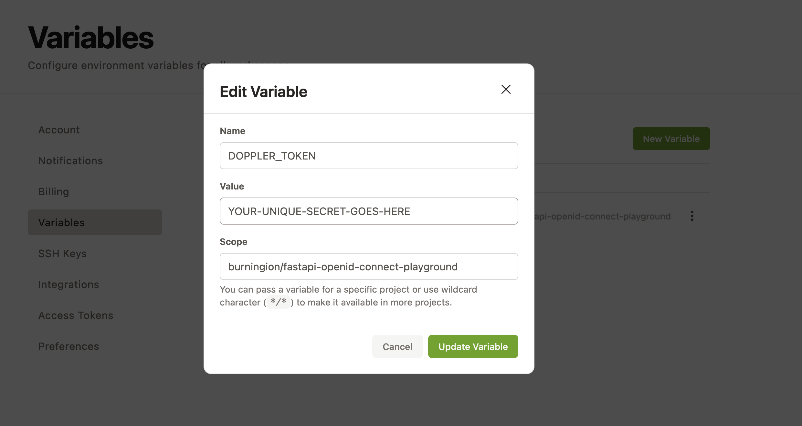

# FastAPI OpenID Connect Playground

**Learning OpenID Connect in Public**

## Setting Up

1. Create a Doppler account and a new project named `fastapi-openid-connect-playground`
2. Add your Doppler API key as an environment variable named `DOPPLER_TOKEN` to Gitpod variables [here](https://gitpod.io/variables)

3. [Generate your secrets](#generating-secrets-for-doppler) and add them to Doppler
4. [](https://gitpod.io/#https://github.com/burningion/fastapi-openid-connect-playground)

## Generating Secrets for Doppler

The two expected, named secrets are `JWT_SECRET_KEY` and `EXAMPLE_USER_HASHED_PASSWORD`. This repo by default expects your Doppler project to be named `fastapi-openid-connect-playground`, and your environment to be called `dev`. You can change this in the `.gitpod.yaml`, if you search for `doppler run`, where our environment variables stored on Doppler get loaded.

To generate a `JWT_SECRET_KEY` run:

```bash
$ openssl rand -hex 32
```

To generate a hashed password for the `EXAMPLE_USER_HASHED_PASSWORD` run:

```bash
$ python generate_password_hash.py <your-password>
```

## How it works

When the project opens, `.gitpod.yml` runs a task that connects to doppler, injects your secrets, and starts up `uvicorn` and FastAPI:

`doppler run -p fastapi-openid-connect-playground -c dev -- uvicorn main:app --reload` 
